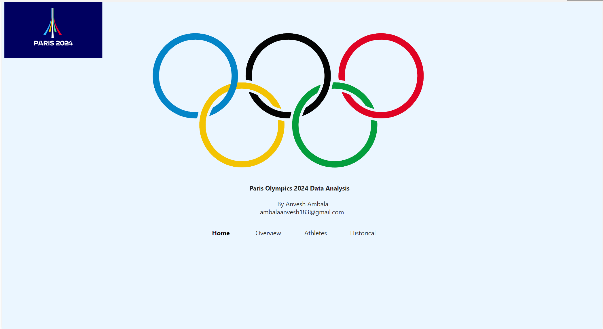
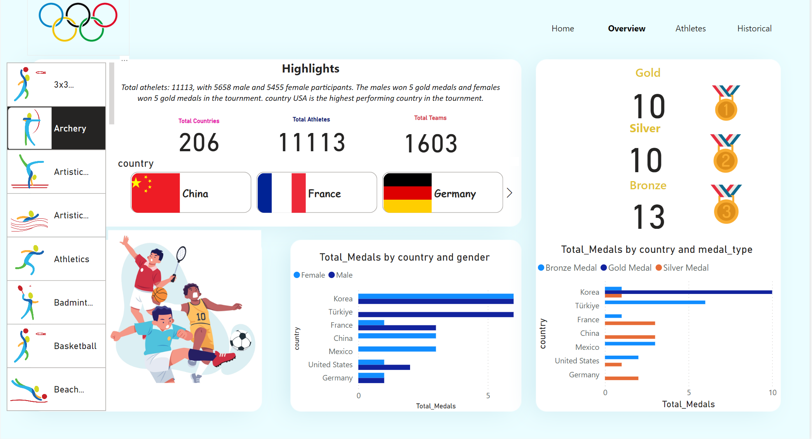
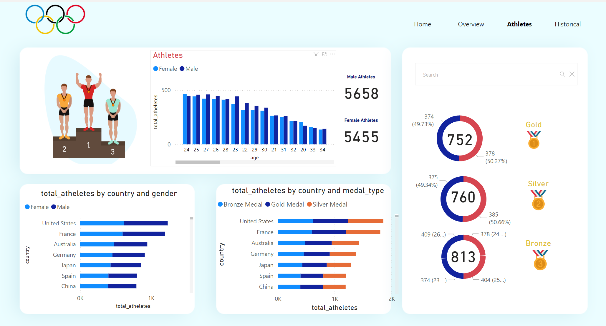
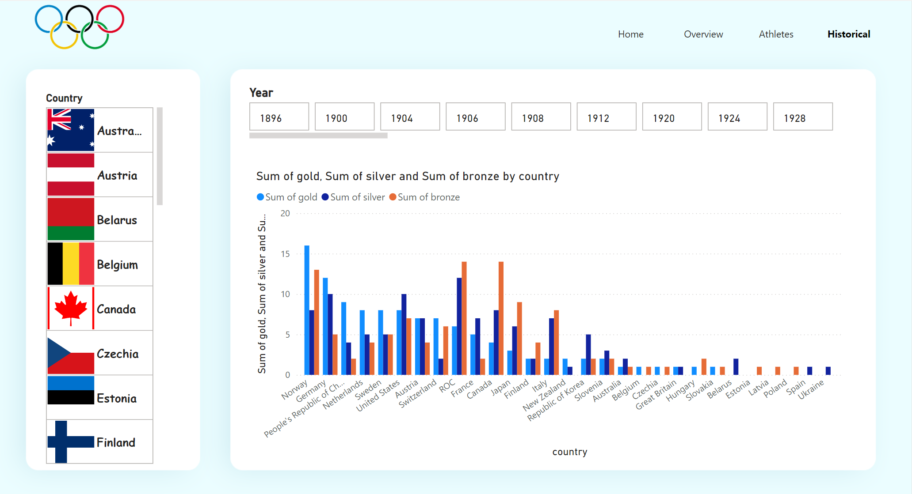

# Paris 2024 Olympics Data Analysis Dashboard

## Overview

This project provides a comprehensive data analysis of the Paris 2024 Olympics. The dashboard includes various visualizations and statistics related to the participating countries, athletes, and medal counts of participants.

## Dashboard Sections

### 1. Home


The home page features the iconic Olympic rings and the title "Paris Olympics 2024 Data Analysis." It serves as the entry point to the dashboard, with navigation tabs for easy access to different sections.

### 2. Overview


The overview section provides a few key statistics:

- **Total Countries**: 206
- **Total Athletes**: 11,113 (5,658 male and 5,455 female)
- **Total Events**: 1,603

It also includes a bar graph showing the total medals by country and gender, with Norway leading in female medals and the USA leading in male medals. Additionally, there are pie charts displaying the distribution of medals by gender and type, and by country and type.

### 3. Athletes


This section includes:

- **Athletes by Country**: A bar graph showing the number of athletes from different countries.
- **Total Medals by Country and Medal Type**: A stacked bar graph displaying the distribution of gold, silver, and bronze medals by country.
- **Medal Guide**: A vertical bar graph showing the count of medals from 0 to 6000.
- **Pie Charts**: Showing the distribution of gold (752), silver (760), bronze (813), and total (2325) medals.

### 4. Historical


The historical section features a bar graph representing the sum of gold, silver, and bronze medals won by various countries in the Olympic Games over different years. This provides a visual representation of Olympic success by country and can be relevant for analyzing historical sports performance data.

## Features

- **Interactive Visualizations**: Click on different elements within the visualizations to filter and drill down into the data.
- **Comprehensive Data**: Includes data on countries, athletes, events, and medals.
- **User-Friendly Interface**: Easy navigation through different sections of the dashboard.

## How to Use

1. **Download and Install Power BI Desktop**: If you don't already have Power BI Desktop installed, you can download it from the [Microsoft Power BI website](https://powerbi.microsoft.com/desktop/).
2. **Open the `.pbix` File**: Once Power BI Desktop is installed, open the `.pbix` file by navigating to `File > Open` and selecting the file from your local directory.
3. **Navigate through the Tabs**: Use the tabs within the Power BI report to explore different sections of the dashboard.
4. **Interact with the Visualizations**: Click on different elements within the visualizations to filter and drill down into the data.
5. **Use Filters**: Apply filters to customize the view according to your interests.

## Installation

To run this project locally, follow these steps:

1. Clone the repository:
   ```bash
   git clone https://github.com/yourusername/paris-2024-olympics-dashboard.git
   ```
2. Navigate to the project directory:
   ```bash
   cd paris-2024-olympics-dashboard
   ```
3. Open the `.pbix` file in Power BI Desktop.

## Contact

For any questions or feedback, please contact
